# Splunk Log Analysis – Linux Server Compromise Investigation

## Project Overview

This project documents my investigation using Splunk to analyze Linux authentication logs and trace the origin of suspicious activity on a compromised server. The goal was to reconstruct the attack timeline, identify gaps in logging, extract indicators of compromise (IOCs), and recommend next steps for incident response.

This work was completed as part of a hands-on cybersecurity training program, with a focus on SIEM analysis, log investigation, and threat hunting.

---

## Environment

- SIEM Platform: Splunk
- Target Host: LINUX01
- Related Hosts: DC01, SERVER01
- Log Sources: /var/log/auth.log, syslog
- Time Range: All time (then narrowed to ±5 minutes around key events)

---

## Investigation Methodology

### 1. Initial Search & Filtering

I started by querying all events from the Linux host, then progressively narrowed the scope:
- Filtered by sourcetype=syslog
- Further filtered by source="/var/log/auth.log" to focus on authentication events

  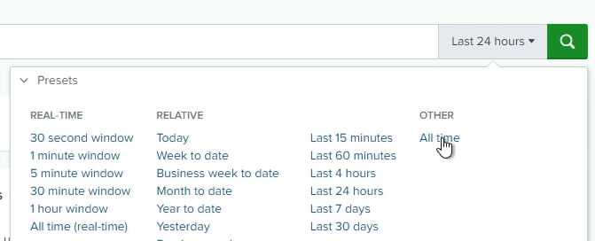
  
  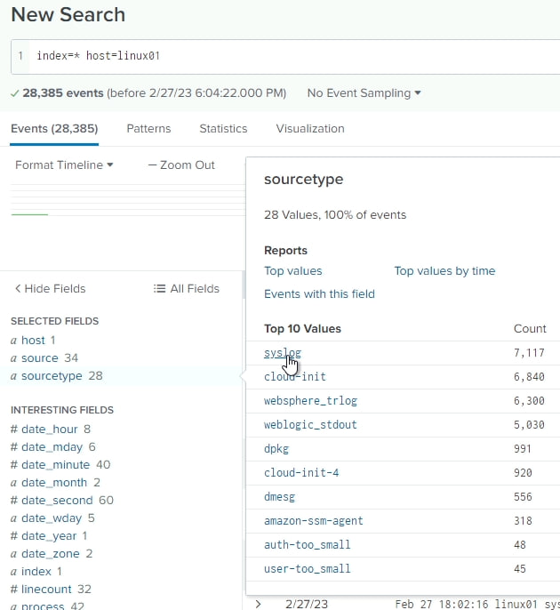

### 2. Identifying Suspicious Activity

While reviewing authentication logs, I identified an account with an unusual name that stood out from normal user accounts. Expanding the event revealed that no individual field was parsed for this account name — which I flagged as a logging gap that should be corrected for better future detection.

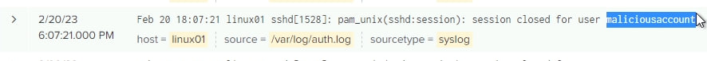

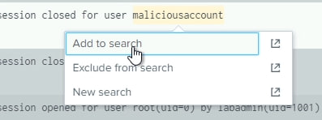

### 3. Tracing Account Creation Chain

By pivoting the search to related accounts, I uncovered a chain of user creation:
- One account created a second account
- That second account was granted sudo privileges
- The compromised user then switched to the newly created account and created a third account

  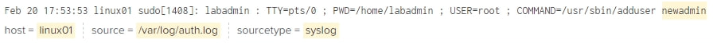

  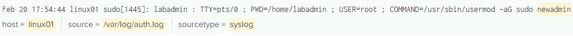

  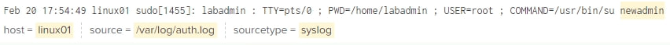

  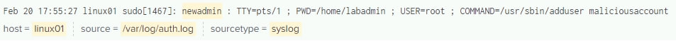

  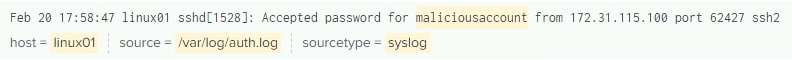

Conclusion: This pattern strongly suggested a compromised account being used to create chained users to obscure the attacker's tracks.

### 4. Identifying Remote Access

I found that the suspicious account had successfully logged into LINUX01 via SSH from DC01 (the domain controller). This expanded the scope of the compromise to include DC01 as a potentially affected host.

### 5. Timeframe Analysis

To gather more actionable intelligence, I adjusted the search to ±5 minutes around the SSH login event and progressively widened the scope:
- Removed the source filter to include all syslog events
- Removed the sourcetype filter to include all logs on the host
- Observed additional activity suggesting malware was uploaded or created on LINUX01

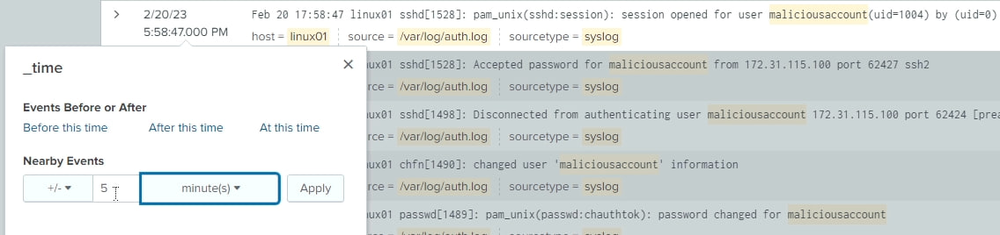

---

## Attack Timeline (Reconstructed)

1. A legitimate admin account (possibly compromised) created a new user account.
2. The compromised admin gave the new account sudo privileges.
3. The attacker switched to the new account and created a third account.
4. The third account logged into LINUX01 via SSH from DC01.
5. Malware was uploaded or created on LINUX01.

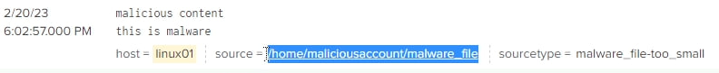

---

## Indicators of Compromise (IOCs)

- Compromised Accounts: Multiple chained user accounts
- Affected Hosts: LINUX01, DC01
- Source of SSH Login: DC01
- Suspicious Activity: User creation, privilege escalation, SSH login, malware placement

---

## Logging Gaps Identified

- The suspicious account name was not parsed into an individual field, making filtering and correlation harder.
- Recommendation: Ensure proper field extraction and normalization in Splunk for authentication logs to improve detection and response time.

---

## Recommended Next Steps

1. Disable all involved accounts immediately.
2. Evaluate which accounts are legitimate and required; rotate passwords for the rest.
3. Take DC01 offline for forensic investigation (if redundant domain controllers exist).
4. Isolate LINUX01 and perform malware analysis on the uploaded artifact.
5. Improve log parsing and field extraction in Splunk.
6. Review access controls and SSH key management.

---

## Skills Demonstrated

- SIEM Analysis (Splunk)
- Log Investigation & Filtering
- Threat Hunting
- IOC Extraction
- Attack Timeline Reconstruction
- Logging Gap Identification
- Incident Response Planning

---
## Tools Used

- Splunk
- Linux (auth.log, syslog)

---

## Ethical Disclaimer

This project documents my personal learning journey using standard cybersecurity tools. All analysis, methodology, and conclusions are my own work.
